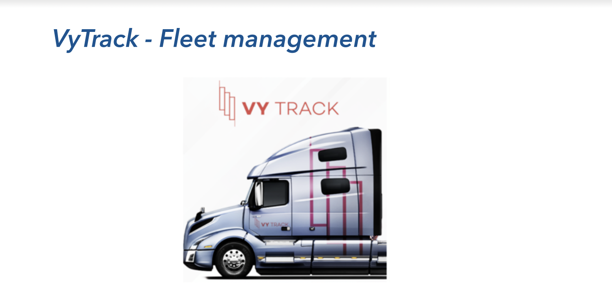

# Vytrack-Fleet Management

##About project:

* Project fleet management app has the below features:

* Customer account management - Create customer account - name, address, ID, location

* User/employee info management - Add, update, delete the users’ and employees’ info

* Create contract via the app - Managers and drivers create contract and the doc is saved in the app

* Manage vehicle information - Create/edit a new car -> plat#, odometer, year, model, cost, etc

* Communication - text message, voice & video call

* Calendar, event creation, announcement, etc features

##Goal:

To make Bug free and higth quality app, QA team create POM Framework witch check all functionality
###Tools:
 * Selenium-Java
 * Maven
 * Jira
 * Git
 * Github
 * IntelleiJ IDEA

### Responsibilities QA Team:

* US1 - Gunay
* US2 - Zeyneb
* US3 - Tariq
* US4 - Tyler
* US5 - Tatiana
* US6 - Rana
* US7 - Regina
* US8 - Korkmaz
* US9 - Ebru
* US10 - Ahmet
* US11 - Jeyhun
* US12 - Nick
* US13 - Nick
* US14 - Mumin

## Questions &  Contributing

 |

 |

 |

!

 |

